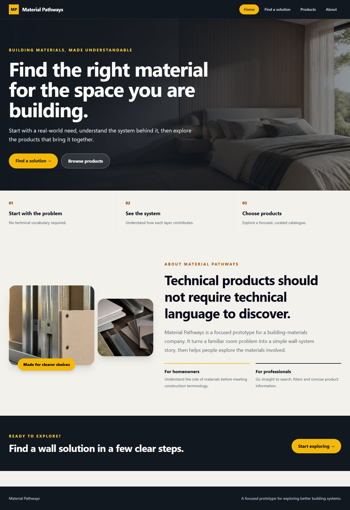
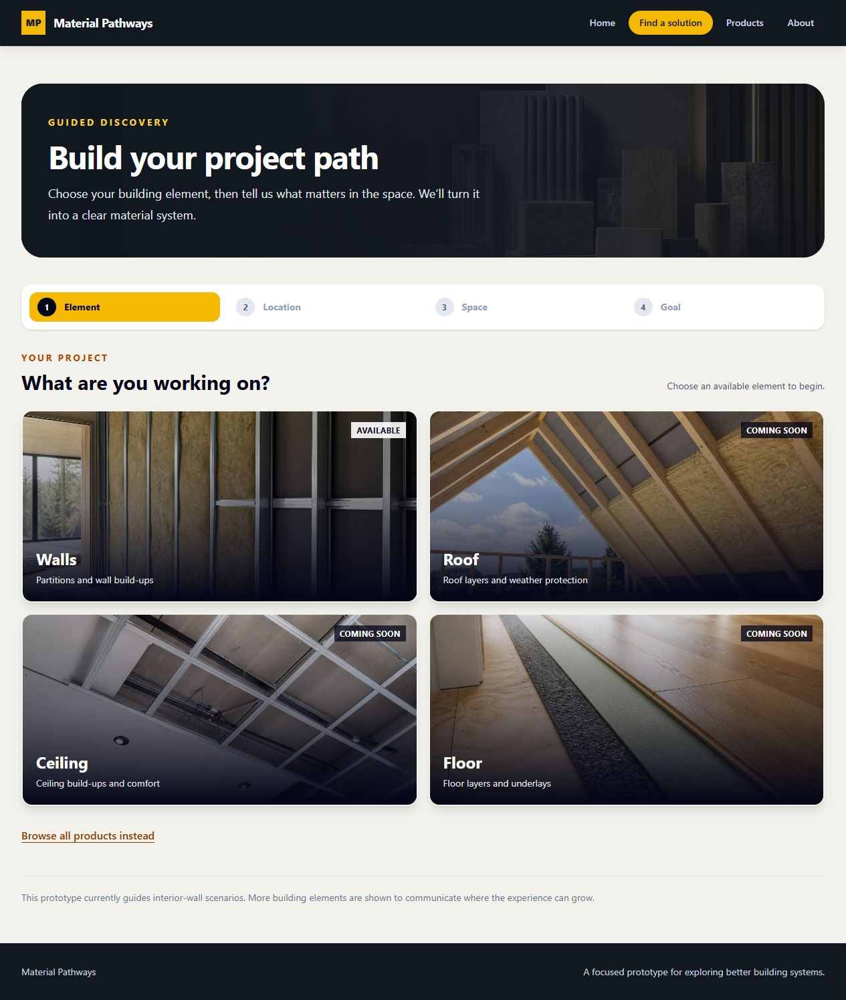
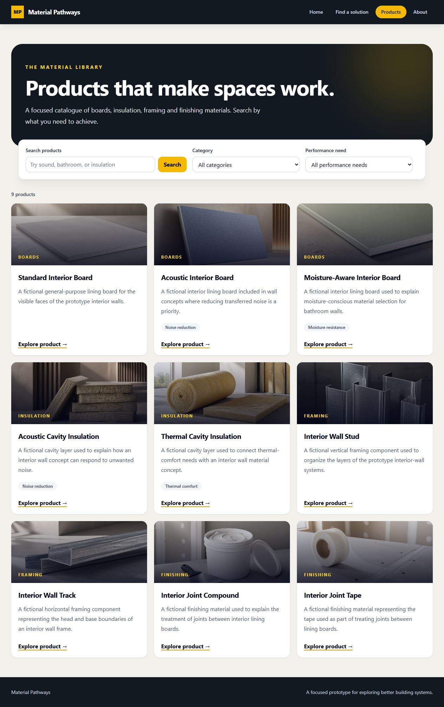
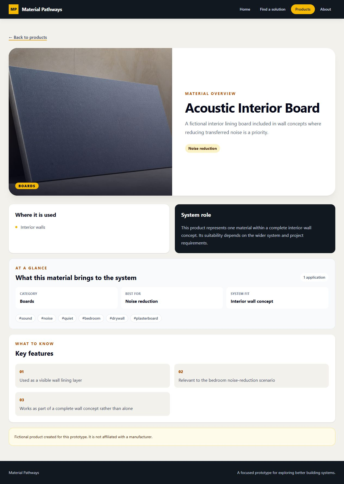
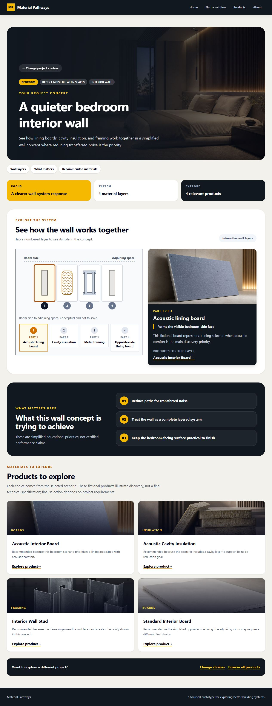

# Material Pathways

Material Pathways is a small building-material discovery prototype for people who may know the problem they want to solve without knowing the construction terminology yet.

It combines two complementary journeys:

- **Find a solution:** choose a familiar space and need, understand a simplified interior-wall system, then explore explainable product recommendations.
- **Browse products:** search and filter a curated catalogue, then open a product detail page.

The guiding flow is **discover → understand → recommend → explore product**.

## Product walkthrough

The screenshots below show the primary journey from first visit to product understanding.

<p><strong>Home — two clear entry points.</strong><br>Visitors can start with a real-world problem or browse the catalogue directly.</p>


<p><strong>Guided discovery — choose context before terminology.</strong><br>The user selects a building element, position, room, and goal using visual choices.</p>


<p><strong>Catalogue — search and filter by intent.</strong><br>Users who already know what they need can scan product cards and narrow results by category or performance need.</p>


<p><strong>Product detail — understand the material quickly.</strong><br>Each product explains its role, applications, performance focus, system fit, and key features.</p>


<p><strong>Solution guide — connect the problem to a system.</strong><br>The result explains the layered wall concept, what each layer does, and which products are relevant.</p>


## MVP scope

The prototype focuses on interior wall systems and a deliberately small, curated dataset:

- bedroom and bathroom contexts;
- acoustic, moisture, and thermal-comfort scenarios;
- nine fictional products across a few useful categories;
- product search, category/performance filtering, and product details;
- an accessible, keyboard-friendly layered wall explanation.

Authentication, commerce, pricing, engineering calculations, a database, and AI-generated recommendations are intentionally outside the MVP. See [PROJECT_PLAN.md](PROJECT_PLAN.md) for the full scope, decisions, risks, and future extensions.

## Technology

- React, TypeScript, Vite, React Router, and Tailwind CSS
- Node.js, Express, and TypeScript
- REST API with native `fetch`
- Local curated JSON data (no database)
- Vitest, React Testing Library, and Supertest

Express was selected over NestJS because this small API benefits from explicit, lightweight layers without adding module, decorator, and dependency-injection ceremony. Local JSON is appropriate because the dataset is small, read-only, and curated for a prototype.

## Architecture

The backend keeps HTTP concerns separate from business rules and data access:

```text
HTTP request → route → controller → service → repository → local JSON
```

The frontend keeps presentation separate from API communication:

```text
page/component → feature state or hook → API service → REST API
```

The repository boundary is intentionally concrete rather than abstract. It keeps a future data-source replacement possible without introducing interfaces or containers that do not solve a current problem.

## API overview

| Endpoint | Purpose |
| --- | --- |
| `GET /api/products?q=&category=&need=` | List, search, and filter products |
| `GET /api/products/:slug` | Retrieve one product |
| `GET /api/scenarios` | List supported guided scenarios |
| `GET /api/scenarios/:slug` | Retrieve one scenario |
| `GET /api/recommendations?room=&need=` | Return a deterministic scenario recommendation |

Recommendations are stored scenario mappings with explicit reasons. They illustrate product discovery and are not certified engineering specifications.

## Data and visual content

Product and scenario data is local, curated, and clearly marked as fictional where appropriate. The interface uses original purpose-made editorial visuals generated for this prototype; they are illustrative and do not represent the fictional catalogue products. Source provenance and content limitations are documented in [docs/SOURCES.md](docs/SOURCES.md).

## Accessibility and responsive behavior

The UI uses semantic headings, labelled controls, visible focus states, keyboard-accessible discovery choices and wall layers, route-change focus management, reduced-motion safeguards, and meaningful loading, empty, error, and invalid-input states. Layouts are tested at desktop and narrow mobile widths, including a 320px viewport.

## Run locally

Prerequisite: Node.js 22 or newer.

```bash
npm install
npm run dev
```

The client runs on `http://localhost:5174` and the API on `http://localhost:3001`. The root development script starts both workspaces. To run them separately:

```bash
npm run dev:client
npm run dev:server
```

## Verification commands

```bash
npm test -- --run
npm run typecheck
npm run lint
npm run build
```

The test suite covers important product API, search/filter, recommendation, discovery, focus-management, and recovery behavior rather than chasing a percentage target.

## Limitations and future evolution

This is an educational product-discovery prototype, not a construction specification tool. A production version could add reviewed manufacturer data, schema validation, content governance, observability, authentication, richer comparison, additional building elements, and a database only when real persistence and management workflows justify it.

## AI-tool usage

AI tools assisted with planning, implementation review, test ideas, and the creation of original illustrative visual assets. All architecture, scope, content, code, and verification decisions were reviewed in the project context. The final implementation remains the author’s responsibility.
